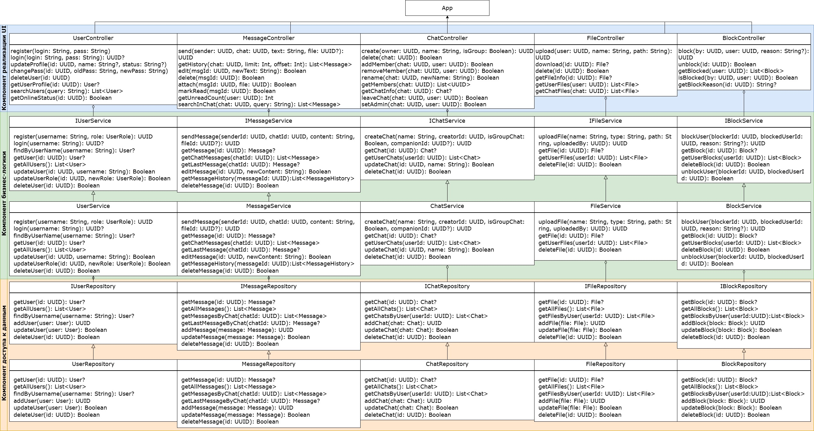

## **Распределенный мессенджер под Android** 
### **Стек технологий**  

#### **1. Язык программирования**
- **Kotlin** 
  - Официальный язык для Android с полной поддержкой Jetpack  
  - Короткий синтаксис, null-safety, корутины для асинхронности  
  - Лучшая совместимость с Java-библиотеками  

#### **2. Архитектура**
- **Clean Architecture + MVVM**
  - Четкое разделение на слои (UI, Domain, Data)  
  - ViewModel для управления состоянием UI
  - Легко тестируемо и масштабируемо  

#### **3. Локальная база данных**
- **Room (SQLite)**  
  - Официальная ORM от Google для работы с SQLite  
  - Поддержка Flow/LiveData для реактивных обновлений UI  
  - Миграция схемы без потери данных  


(ps контроллеров нет и не нужны)

---
### Структура проекта (до разбиения на модули)
UI → Presenter → Domain ← Data
```
src/
├── data/
│   ├── local/
│   │   ├── dao/
│   │   │   ├── MessageDao.kt
│   │   │   ├── ChatDao.kt
│   │   │   ├── UserDao.kt
│   │   │   ├── FileDao.kt
│   │   │   └── BlockDao.kt
│   │   ├── entities/
│   │   │   ├── MessageEntity.kt
│   │   │   ├── ChatEntity.kt
│   │   │   ├── UserEntity.kt
│   │   │   ├── FileEntity.kt
│   │   │   └── BlockEntity.kt
│   │   ├── irepositories/
│   │   │   ├── IMessageRepository.kt
│   │   │   ├── IChatRepository.kt
│   │   │   ├── IUserRepository.kt
│   │   │   ├── IFileRepository.kt
│   │   │   └── IBlockRepository.kt
│   │   └── repositories/
│   │   │   ├── MessageRepository.kt
│   │   │   ├── ChatRepository.kt
│   │   │   ├── UserRepository.kt
│   │   │   ├── FileRepository.kt
│   │   │   └── BlockRepository.kt
│   │   └── AppDatabase.kt
│   │   └── Converters.kt
│   └── remote/  # в теории мб API
│
├── domain/
│   ├── models/
│   │   ├── User.kt
│   │   ├── Message.kt
│   │   ├── Chat.kt
│   │   ├── File.kt
│   │   └── Block.kt
│   ├── controllers/
│   │   ├── UserController.kt
│   │   ├── MessageController.kt
│   │   ├── ChatController.kt
│   │   ├── FileController.kt
│   │   └── BlockController.kt
│   └── iservices/
│   │   ├── IMessageService.kt
│   │   ├── IChatService.kt
│   │   ├── IUserService.kt
│   │   ├── IFileService.kt
│   │   └── IBlockService.kt
│   └── services/
│       ├── MessageService.kt
│       ├── ChatService.kt
│       ├── UserService.kt
│       ├── FileService.kt
│       └── BlockService.kt
│
└── presenter/
│   └── viewmodels/
│       └── AuthViewModel.kt
│
└── ui/
│   └── screens/
│       ├── AuthScreen.kt
│       └── MainScreen.kt
│
└── androidTest/
│   └── integration/
│       └── repositories/
│           ├── MessageRepositoryTest.kt
│           ├── ChatRepositoryTest.kt
│           ├── UserRepositoryTest.kt
│           ├── FileRepositoryTest.kt
│           └── BlockRepositoryTest.kt
│
└── test/
    └── unit/
        └── services/
            ├── MessageServiceTest.kt
            ├── ChatServiceTest.kt
            ├── UserServiceTest.kt
            ├── FileServiceTest.kt
            └── BlockServiceTest.kt
```
